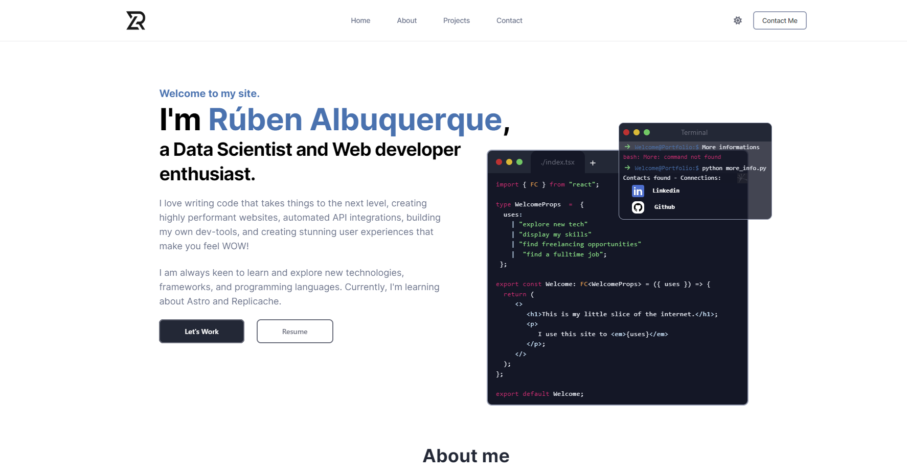

# My Personal portfolio

[DEMO](https://rubenalbuquerque.github.io/Portfolio/)

# deploy github

-   npm install gh-pages --save-dev
    -   add homepage in package.json -
    -   add script in package.json -
-   npm run deploy
-   go to github repo settings and change source to gh-pages branch

## Apos ter tudo feito basta correr

-   npm run deploy
-   E ir para https://rubenalbuquerque.github.io/Portfolio/ e esperar
